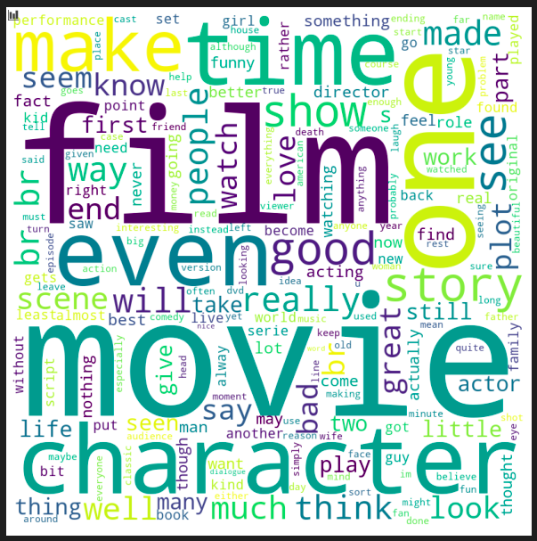
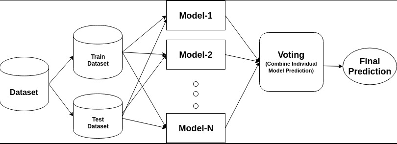
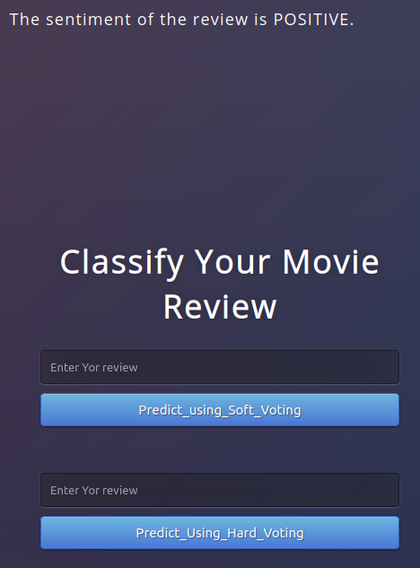

# Automated-Movie-Review-Classifier
[![Contributors][contributors-shield]][contributors-url]
[![Forks][forks-shield]][forks-url]
[![Stargazers][stars-shield]][stars-url]

<!-- PROJECT LOGO -->
<br />
<p align="center">
    
  </a>

  <h2 align="center">Automated Movie Review Classifier</h2>

  <p align="center">
    An awesome tool to automatically classify your movie reviews
    <br />
  </p>
</p>

<!-- TABLE OF CONTENTS -->
<details open="open">
  <summary>Table of Contents</summary>
  <ol>
    <li>
      <a href="#about-the-project">About The Project</a>
      <ul>
        <li><a href="#built-with">Built With</a></li>
      </ul>
    </li>
    <li>
      <a href="#getting-started">Getting Started</a>
      <ul>
        <li><a href="#prerequisites">Prerequisites</a></li>
        <li><a href="#installation">Installation</a></li>
      </ul>
    </li>
    <li><a href="#usage">Usage</a></li>
    <li><a href="#roadmap">Roadmap</a></li>
    <li><a href="#contributing">Contributing</a></li>
    <li><a href="#acknowledgements">Acknowledgements</a></li>
  </ol>
</details>


<!-- ABOUT THE PROJECT -->
## About The Project
<p align="center">


There are many great Deep Learning models available, however,here I focussed on creating a light weight blending model using conventional ML algorithms with comparable metrics.

Here's why:
* The project does not use high memory Deep Learning Models.
* The response time is pretty short with comparable performance.
* The model leverages a naive approach with no emphasis on pre-trained word embeddings.
* The model is trained with Logistic Regression,Random Forest and Naive Bayes Classifier tuned by Hyperopt on both Count vectorized And TF-IDF vectorized word representations achieving a low bias and low variance model.

### Built With

The major frameworks used in the project -
* [Scikit_Learn](https://scikit-learn.org/stable/)
* [Flask](https://flask.palletsprojects.com/en/1.1.x/)
* [Hyperopt](https://hyperopt.github.io/hyperopt/)
* [NLTK](https://www.nltk.org/)
* [Docker](https://www.docker.com/)


<!-- GETTING STARTED -->
## Getting Started

The Project is currently containerised by the use of Docker.However,it can easily be deployed on cloud platforms as well.

### Prerequisites

The only user-dependency as of now is only a Docker enabled system.
* Docker-Please follow the instructions for your respective kernels at [https://docs.docker.com/engine/install/](https://docs.docker.com/engine/install/)

### Installation

1. Clone the repository on the Docker enabled Machine.
2. Open CLI in the working directory.
3. Building the Docker Image 
   ```sh
   docker build -t review_classify .
   ```
4. Running the Docker Container
   ```sh
   docker run -p 8080:8080 review_classify
   ```
5. Open the website given under Running in tab.
* Tested for virtualization enabled machine.
* For other machines replace the url by ip address followed by the port number.


<!-- USAGE EXAMPLES -->
## Usage

The model can be used as a GUI deploying both soft-voting and hard-voting seperately. It is highly recommended to use a soft voting classifier for a more robust classification.
<p align="center">
 

An API can also be leveraged once the model is deployed on the cloud.
The API only consists of the more stringent soft-voting classifier.Stay Tuned for cloud deployment. 

<!-- ROADMAP -->
## Roadmap

See the [open issues](https://github.com/Consultingcriminal/Automated-Movie-Review-Classifier/issues) for a list of proposed features (and known issues).


<!-- CONTRIBUTING -->
## Contributing

Contributions are what make the open source community such an amazing place to be learn, inspire, and create. Any contributions you make are **greatly appreciated**.

1. Fork the Project
2. Create your Feature Branch (`git checkout -b feature/AmazingFeature`)
3. Commit your Changes (`git commit -m 'Add some AmazingFeature'`)
4. Push to the Branch (`git push origin feature/AmazingFeature`)
5. Open a Pull Request

<!-- ACKNOWLEDGEMENTS -->
## Acknowledgements
* [Kaggle](https://www.kaggle.com/c/word2vec-nlp-tutorial/data)
* [Mr. Abhishek Thakur for a thorough intution into blending and hyper-parameter tuning.](https://www.youtube.com/watch?v=TuIgtitqJho&t=2511s)
* [Mr. Krish Naik for the amazing Docker Playlist](https://www.youtube.com/playlist?list=PLZoTAELRMXVNKtpy0U_Mx9N26w8n0hIbs)
* [Mr. Moez Ali for Model Deployment Using Flask ](https://moez-62905.medium.com/)


<!-- MARKDOWN LINKS & IMAGES -->
<!-- https://www.markdownguide.org/basic-syntax/#reference-style-links -->
[contributors-shield]: https://img.shields.io/github/contributors/Consultingcriminal/Automated-Movie-Review-Classifier/?style=for-the-badge
[contributors-url]: https://github.com/Consultingcriminal/Automated-Movie-Review-Classifier/graphs/contributors
[forks-shield]: https://img.shields.io/github/forks/othneildrew/Best-README-Template.svg?style=for-the-badge
[forks-url]: https://github.com/othneildrew/Best-README-Template/network/members
[stars-shield]: https://img.shields.io/github/stars/othneildrew/Best-README-Template.svg?style=for-the-badge
[stars-url]: https://github.com/othneildrew/Best-README-Template/stargazers
[issues-shield]: https://img.shields.io/github/issues/othneildrew/Best-README-Template.svg?style=for-the-badge
[issues-url]: https://github.com/othneildrew/Best-README-Template/issues
[license-shield]: https://img.shields.io/github/license/othneildrew/Best-README-Template.svg?style=for-the-badge
[license-url]: https://github.com/othneildrew/Best-README-Template/blob/master/LICENSE.txt
[linkedin-shield]: https://img.shields.io/badge/-LinkedIn-black.svg?style=for-the-badge&logo=linkedin&colorB=555
[linkedin-url]: https://linkedin.com/in/othneildrew
[product-screenshot]: images/screenshot.png
